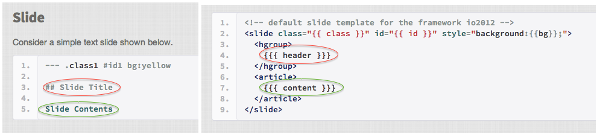

## 安裝

透過`devtools`從github安裝`Slidify`


```r
library(devtools)
install_github("slidify", "ramnathv")
```


### `devtools`的安裝

- 如果是Windows作業系統，請先安裝[`Rtools`](http://cran.r-project.org/bin/windows/Rtools/)
- 可參考社群教學影片：[安裝Rtools(Windows) ](http://www.youtube.com/watch?v=enPPMHr5SrM&list=PLM7HGQkDNOHtqUTowalvnOwZCx4mWDmte&feature=share&index=4)

--- 

## 開始人生第一個Slidify投影片


```r
library(slidify)
author("資料夾名稱")
```


- 會建立一個資料夾以及預設的`index.Rmd`
- 會建立一個git repository

TODO: 影片 or Demo

---

## 第一眼：

    ---
    title    : Title 
    substitle: Subtitle
    author   : Author
    job      : Job
    widgets  : []
    mode     : selfcontained
    ---
    
    ## Slide 1
    
    Use an empty line followed by three dashes to separate slides!
    
    --- .class #id 
    
    ## Slide 2

--- #cover bg:url(assets/img/Cover.png)

## 封面

---

## 投影片

    ---
    
    ## Slide 1
    
    Use an empty line followed by three dashes to separate slides!
    
    --- .class #id 
    
    ## Slide 2

- `---`表示分頁
- `##`表示投影片標題
- 採用Markdown語法，細節請參考[Markdown語法說明](http://markdown.tw/)，可在[Dillinger](http://dillinger.io)試玩。

---

## 與R 的整合

    ---
    
    \```{r}
    a <- 1
    a + 1
    f(a)
    \```
    
    ---


```
## [1] 2
```

```
## Error: 沒有這個函數 "f"
```


- 採用類似[knitr](http://yihui.name/knitr/)的方法
    - 可參考[20121203 MLDM Monday [markdown + knitr]](http://www.youtube.com/watch?v=OHKZLeKlUsM&feature=share)

--- &twocol

## 投影片的客製化



*** =left

### Layout

- 利用如`--- &twocol`來指定要用的layout
- 可以把layout放置於`assets/layout`底下，如：`assets/layouts/twocol.html`
- 產生投影片的套件是[whisker](http://cran.r-project.org/web/packages/whisker/index.html)

*** =right


--- &twocol

## 自行定義twocolwithfoot

*** =left


*** =right


--- &twocolwithfoot

## 這是標題

```
這段文字在上方
```

*** =left

```
這段文字在左側
```

*** =right

```
這段文字在右側
```

*** =foot

<hr/>

```
這段文字在下方
```

*** =pnotes

這段文字在註解

---

## 發佈


```r
publish_dropbox
publish_gist
publish_github
publish_rpubs
```


--- &twocol

## 模板候選

*** =left

### CSS

```
slide:not(.segue) h2,
slide:not(.segue) h3,
slides slide.large article p,
article p, article li, article li.build {
    font-family: 'Source Sans Pro', 
    'Helvetica', 'Crimson Text', 'Garamond', 
    'Palatino', sans-serif;
}

slides slide.large article p {
    font-size: 52px;
    font-style: normal;
    font-weight: bold;
    line-height: 1.2em;
}
```

*** =right

    --- &vcenter .large
    
    測試文字
    
    --- &vcenter .large

--- &vcenter .large

測試文字

--- &twocol

## 互動式測驗

*** =left

在YAML中的widget上新增`quiz`和`bootstrap`

```
widgets     : [quiz, bootstrap]
```

*** =right

    --- &radio
    
    ## Question 1
    
    What is 1 + 1?
    
    1. 1
    2. _2_
    3. 3
    4. 4
    
    *** .hint
    This is a hint
    
    *** .explanation
    This is an explanation

--- &radio

## Question 1

What is 1 + 1?

1. 1
2. _2_
3. 3
4. 4

*** .hint
This is a hint

*** .explanation
This is an explanation

--- &twocol

## 互動式圖片

*** =left

在YAML中如下設定：

```
ext_widgets: {rCharts: [libraries/nvd3]}
```

*** =right

    ## Example 1 Facetted Scatterplot
    names(iris) = gsub("\\.", "", names(iris))
    rPlot(SepalLength ~ SepalWidth | Species, data = iris, color = 'Species', type = 'point')

---

## Example 1 Facetted Scatterplot


```r
library(rCharts)
names(iris) = gsub("\\.", "", names(iris))
rPlot(SepalLength ~ SepalWidth | Species, data = iris, color = "Species", type = "point")
```

<iframe src='
assets/fig/unnamed-chunk-5.html
' scrolling='no' seamless class='rChart 
polycharts
 '
id=iframe-
chart52664a81efa
></iframe>
<style>iframe.rChart{ width: 100%; height: 400px;}</style>


---

## Example 2 Facetted Barplot


```r
hair_eye = as.data.frame(HairEyeColor)
rPlot(Freq ~ Hair | Eye, color = "Eye", data = hair_eye, type = "bar")
```

<iframe src='
assets/fig/unnamed-chunk-6.html
' scrolling='no' seamless class='rChart 
polycharts
 '
id=iframe-
chart5267816c16e
></iframe>
<style>iframe.rChart{ width: 100%; height: 400px;}</style>


--- &twocol

## 內嵌R Console

*** =left

YAML:

```
widgets    : [bootstrap, quiz, shiny, interactive]
```

不再使用`slidify`，改用`runDeck`啟動投影片

*** =right

    --- &interactive
    
    ## Interactive Console
    
    \```{r opts.label = 'interactive', results = 'asis'}
    require(googleVis)
    M1 <- gvisMotionChart(Fruits, 
    idvar = 'Fruit', timevar = 'Year')
    print(M1, tag = 'chart')
    ```

--- &interactive

## Interactive Console

<textarea class='interactive' id='interactive{{slide.num}}' data-cell='{{slide.num}}' data-results='asis' style='display:none'>require(googleVis)
M1 <- gvisMotionChart(Fruits, 
idvar = 'Fruit', timevar = 'Year')
print(M1, tag = 'chart')</textarea>


--- &interactive


